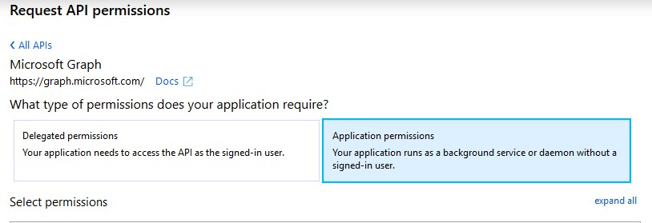
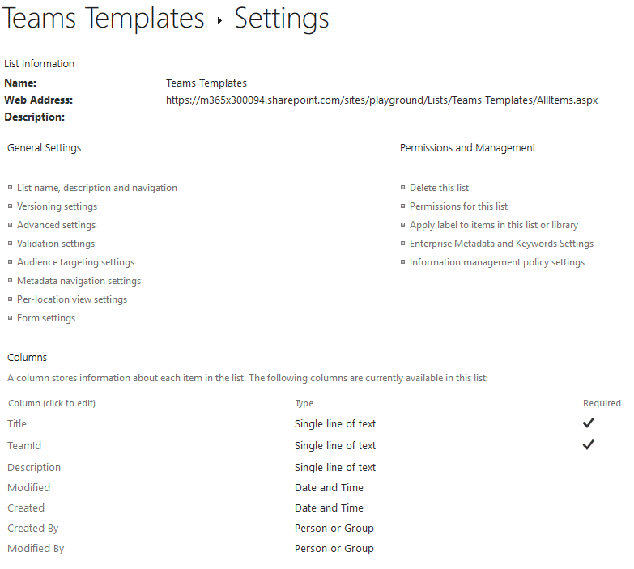
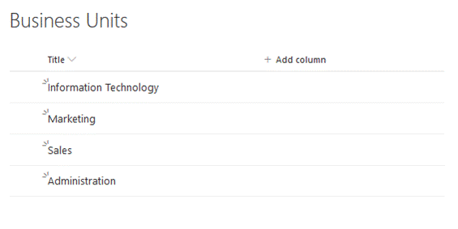
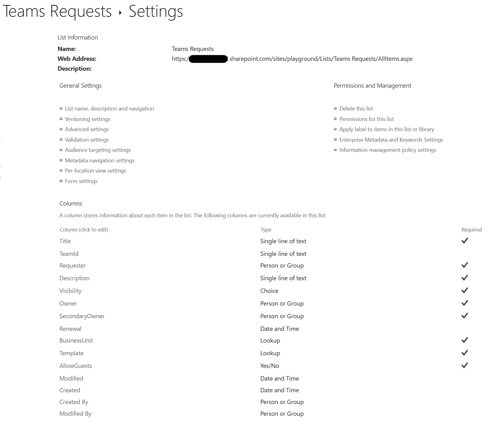
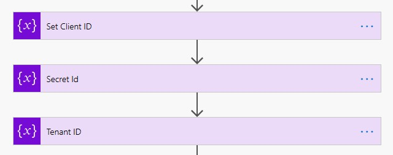

# Teams Requests
Custom Microsoft Teams creation process using SharePoint Online and Microsoft Flow that allows for additional metadata to be collected during the request, enabling organizations to implement their governance requirements while still allowing automated self-service.

Employees will fill out a request form in SharePoint Online (or in PowerApps, should you choose to create one). A Flow will trigger on that new SharePoint Online item and use the Microsoft Graph API to create a new team based on the selected template, assign the requested owners, and notify the requester with a Teams notification.
## Register an Application in Azure Active Directory
1. Browse to https://aad.portal.azure.com
2. Register a new application: https://portal.azure.com/#blade/Microsoft_AAD_RegisteredApps/ApplicationsListBlade

3. Copy the **Application (client) ID** and the **Directory (tenant) ID** from the Overview page into OneNote/notepad
4. Click on **Certificates & secrets** and create a new client secret (copy/paste it into OneNote/notepad)

5. Click on **API permissions** and add the following permissions for Microsoft Graph (Application, not delegated): Group.ReadWrite.All, User.ReadWrite.All

6. Click the **Grant admin consent for [tenant]** button

## Create SharePoint Online lists
The following custom lists in SharePoint are used in the sample Flow and can be modified/omitted to fit your needs. Any alterations may require updates to get the Flow to work, depending on the change.
### Teams Templates
Create teams in Microsoft Teams to act as your templates, then store references to those templates in this simple custom list to be chosen from when someone requests a new Team. This list will be used as a lookup on the Teams Requests list. You can copy/paste the TeamID from the Teams Admin Center.

### Business Units
This custom list (with no additional custom fields) is entrirely optional and just an example of the type of extra information you can collect and store to meet your governance needs. This list will be used as a lookup on the Teams Requests list. 

### Teams Requests
This custom list is where people will submit their requests. You can certainly make a PowerApp on top of this list for people to use.

## Import Microsoft Flow
1. Browse to https://flow.microsoft.com
2. Click on **My flows**
3. Click **Import**

4. Download [TeamsCreationGovernance.zip](/TeamsCreationGovernance.zip) and upload your copy of this file
4. After importing, edit the Flow to plug in your IDs for the AAD Application, your SharePoint Online site and lists, etc.

5. Alter this Flow to meet your needs, including populating the Renewal field, setting the External Sharing attribute for the Team, etc.
